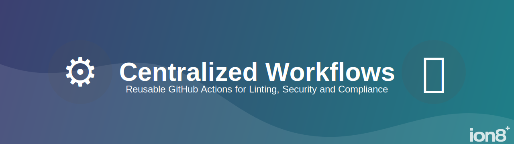

This repo contains our reusable workflows, used in repositories across the organization.

# ✒️ Linting
## `ci-next.js.yaml`
Build and test a Next.js application that uses yarn. Uses caching for the yarn downloads and Next.js build artifacts where possible.

If codeceptjs is not in the project dependencies, the test step will be skipped.

## `ci-python.yaml`
Lint and test a Python application that uses poetry, flake8 and pytest. Uses caching for the poetry downloads.

If flake8, black, or pytest are not in the dependencies, their steps will be skipped.

# 🤖 AI Review
## `ai_pr_review.yml`
Automatically reviews pull requests using **PR-Agent**, an AI-powered code review tool. The workflow triggers on pull request events (opened, reopened, ready_for_review) and issue comments, providing automated code review feedback.

The workflow is configured with custom review instructions that emphasize:
- **Code correctness**, security issues, performance risks, and unsafe patterns
- **Exception hygiene** - ensuring exceptions align with project standards
- **Documentation sync** - suggesting README and environment variable documentation updates when public behavior changes
- **Noise control** - keeping feedback brief for small or low-impact PRs

Auto-review and auto-describe are enabled, while auto-improve is disabled by default.

## How do I get AI PR Review working in my repo?

In each target repository, create `.github/workflows/ai-pr-review.yml`:

```yaml
name: AI PR Review

on:
  pull_request:
    types: [opened, reopened, ready_for_review]
  issue_comment:

jobs:
  call-ai-review:
    uses: ion8/workflows/.github/workflows/ai_pr_review.yml@main
    secrets:
      OPEN: ${{ secrets.OPENAI_CODE_REVIEW_API_KEY }}
```

**Note:** This workflow uses the organization-level `OPENAI_CODE_REVIEW_API_KEY` environment variable, so no per-repository configuration is needed. The OpenAI API key is managed centrally at the organization level.

# 🔐 Security
We'll be adding security workflows soon™️.

# ⭐ Compliance
For compliance reasons, we have templates that will generate a list of SOUP (Software of Unknown Pedigree). This works as follows:

#### We have two workflows stored in `.github/workflows/`.
- `cook-python-soup.yml`
- `cook-js-soup.yml`


#### Both will:
- Accept a `branch` input to know which branch to push changes to.
- Check out the target repository (the repo where the workflow is running).
- Check out the `workflows` repository to access `generate_soup.py`.
- Run the appropriate license scanning commands for `pip-license` or `license-checker` to generate a JSON file with dependencies
- Run the Python script to parse the JSON file and generate a `SOUP.md` document with this information presented beautifully.
- Commit and push changes to `SOUP.md` if any changes are detected.

## How do I get SOUP CI/CD working in my repo?

In each target repository, you need to do two things:
- Add the license dependency this workflow depends on. (That's `pip-licenses` for Python and `license-checker` for JavaScript)
- Create a minimal workflow file that triggers on dependency changes and calls the reusable workflow from the `workflows` repository. See example below.

### Python Repository Example

For a Python repo using Poetry, create `.github/workflows/cook-soup-delicious.yml`:

```yaml
name: Cook up some delicious SOUP (Python)

on:
  # Trigger when dependencies change
  push:
    branches: [ main ]
    paths:
      - 'poetry.lock'
      - 'pyproject.toml'

  # Also allow manual triggering
  workflow_dispatch: 
    inputs: 
      branch: 
        type: string 
        default: "main"

jobs:
  call-python-soup:
    # Calls the reusable workflow from the workflows repo
    uses: ion8/workflows/.github/workflows/cook_python_soup.yml@main
    with:
      branch: 'main'
```
_______


### JavaScript Repository Example

For a JS repo using npm, create `.github/workflows/cook-soup-delicious.yml`:

```yaml
name: Cook up some delicious SOUP (JavaScript)

on:
  # Trigger when dependencies change (npm lock file)
  push:
    branches: [ main ]
    paths:
      - 'package-lock.json'
      - 'package.json'
      - 'yarn.lock'

  # Also allow manual triggering
  workflow_dispatch: 
    inputs: 
      branch: 
        type: string 
        default: "main"

jobs:
  call-js-soup:
    uses: ion8/workflows/.github/workflows/cook_js_soup.yml@main
    with:
      branch: 'main'
```